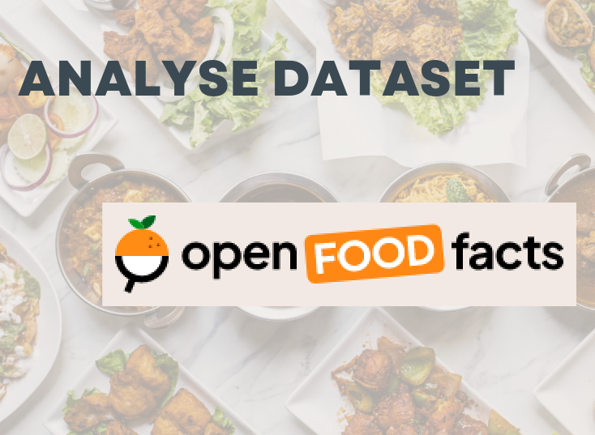

# Préparation des Données pour un Organisme de Santé Publique

  

## Contexte

Dans le cadre de ma mission en tant que Data Scientist, j'ai été chargé de travailler sur un projet pour **Santé publique France**. L'objectif était de nettoyer et d'explorer un jeu de données issu de la base **Open Food Facts**. Cette base de données, open source, permet aux particuliers et aux organisations de connaître la qualité nutritionnelle des produits alimentaires. Le projet visait à améliorer cette base en créant un système de suggestion ou d'auto-complétion pour faciliter la saisie des informations par les utilisateurs.

## Objectif du Projet

Le projet se concentre sur la prise en main des données, leur nettoyage, et leur exploration pour évaluer la faisabilité de l'idée d'application proposée par **Santé publique France**. Cela inclut l'identification des variables pertinentes, le traitement des valeurs manquantes et aberrantes, ainsi que la réalisation d'analyses statistiques univariées et multivariées. Enfin, une attention particulière a été portée au respect des principes du RGPD.

## Étapes de l'Analyse

1. **Traitement des Données** :
    - Identification des variables pertinentes pour les analyses.
    - Nettoyage des données avec mise en évidence et traitement des valeurs manquantes et aberrantes.
    - Automatisation des traitements pour assurer la reproductibilité.

2. **Analyse Statistique** :
    - Réalisation d'analyses univariées et multivariées pour comprendre les distributions et corrélations au sein des données.
    - Utilisation d'une Analyse en Composantes Principales (ACP) pour explorer les relations multivariées.

3. **Visualisation des Données** :
    - Production de graphiques variés (boxplots, histogrammes, scatter plots, etc.) pour illustrer les analyses.
    - Attention portée à la lisibilité et à la clarté des visualisations pour un public néophyte.

4. **Respect des Normes RGPD** :
    - Explication des 5 grands principes du RGPD et démonstration du respect de ces principes dans le cadre du projet.

## Livrables

- **Notebook** : Contient l'ensemble des traitements des données, ainsi que les analyses univariée, multivariée et en composantes principales (ACP).
- **Présentation** : Support pour la soutenance, comprenant :
  - Les opérations de nettoyage effectuées.
  - La description et l'analyse des variables importantes.
  - L'analyse multivariée et les résultats en lien avec l'idée d'application du client.
  - Observations sur la faisabilité de l'application proposée.
  - Une synthèse des conclusions sur la faisabilité du projet.

## Soutenance

### Déroulement de la Soutenance

- **Présentation (20 minutes)** :
    - Introduction de la mission (2 minutes).
    - Démarche méthodologique de nettoyage (8 minutes).
    - Démarche méthodologique d’exploration de données (8 minutes).
    - Synthèse des faits pertinents pour l’application (2 minutes).
    
- **Discussion (5 minutes)** :
    - Échanges sur les choix méthodologiques et les résultats.
    
- **Débriefing (5 minutes)** :
    - Retour sur la présentation et discussion des points forts et des axes d'amélioration.

### Visionner la Soutenance

Vous pouvez visionner l'enregistrement vidéo de la soutenance [**Lien vers la soutenance vidéo**](https://youtu.be/_5uF8SQhgR0?si=80bwlASmLKDpoITn) 

## Contact

Pour plus d'informations sur moi ou pour accéder à mes coordonnées, veuillez visiter mon site web : [alexandre.rogues.fr](https://alexandre.rogues.fr).

Merci de votre intérêt pour ce projet !

